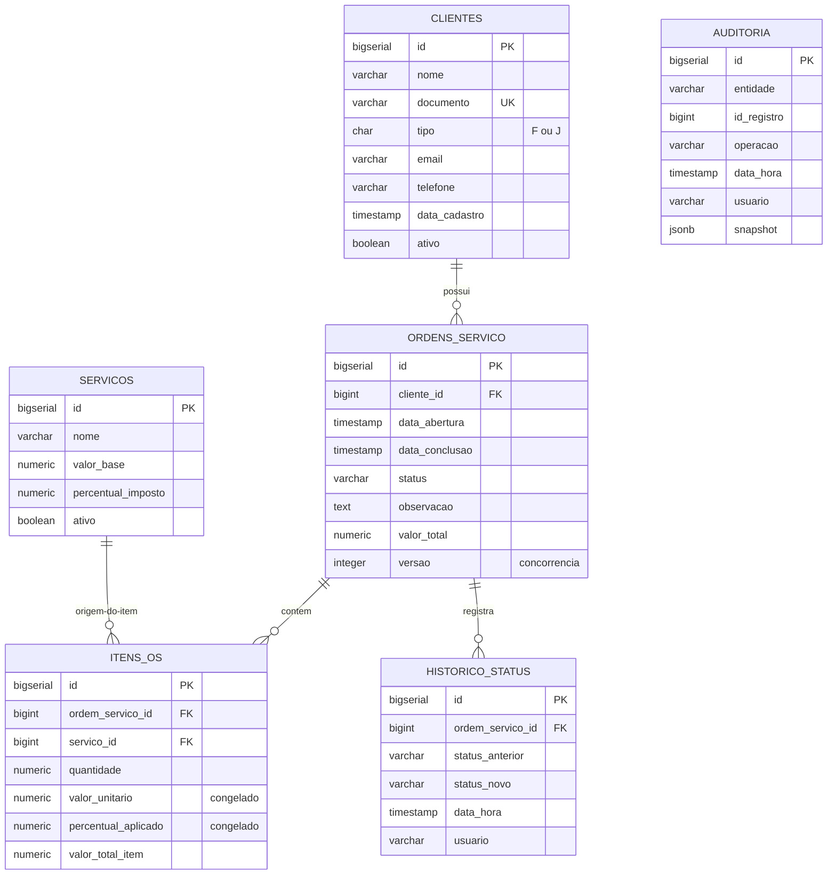

# Sistema de Gestão de Ordens de Serviço
 
> Teste prático para vaga de Desenvolvedor C# Pleno
> Stack: WinForms · .NET Framework 4.6 · PostgreSQL · Npgsql · ReportViewer
 
---
 
## Sumário
 
- [Visão geral](#visão-geral)
- [Stack utilizada](#stack-utilizada)
- [Arquitetura](#arquitetura)
- [Modelo de dados](#modelo-de-dados)
- [Decisões técnicas](#decisões-técnicas)
- [Estratégia de concorrência](#estratégia-de-concorrência)
- [Estratégia de auditoria](#estratégia-de-auditoria)
- [Como rodar](#como-rodar)
- [Estrutura de pastas](#estrutura-de-pastas)
- [Documentação adicional](#documentação-adicional)
- [Limitações conhecidas](#limitações-conhecidas)
---
 
## Visão geral
 
Sistema desktop para gestão de Ordens de Serviço (OS) com controle financeiro simplificado, auditoria e relatórios gerenciais. Permite cadastrar clientes (PF/PJ) e serviços, abrir ordens vinculadas a clientes, adicionar itens (com valor unitário e imposto congelados no momento da inclusão), controlar transições de status (Aberta → Em Andamento → Concluída/Cancelada) e emitir relatório gerencial agrupado por cliente com totais e exportação em PDF.
 
A aplicação foi estruturada como se fosse evoluir para produção: arquitetura em camadas, controle transacional rigoroso, concorrência otimista para múltiplos usuários, auditoria com snapshot JSON e logs em arquivo. Todas as operações que tocam mais de uma tabela ocorrem em transação única com rollback em qualquer falha.
 
---
 
## Stack utilizada
 
| Componente | Versão | Motivo da escolha |
|---|---|---|
| .NET Framework | **4.6** | Versão exigida pelo teste; instalada via Developer Pack oficial. |
| Visual Studio | 2026 | IDE atual. Suporta `.csproj` legado e formato `.slnx` moderno. |
| PostgreSQL | 14+ | Banco relacional robusto. Recursos usados: `JSONB`, `ENUM`, partial index, GIN index, triggers. |
| Npgsql | 4.0.13 | Driver oficial para PostgreSQL. Versão 4.0.x é a última oficialmente compatível com .NET 4.6. |
| Newtonsoft.Json | 12.0.3 | Serialização do snapshot de auditoria em JSON. Versão compatível com .NET 4.6. |
| ReportViewer | 150.1652 | Geração de relatórios RDLC e exportação em PDF. (Versão 15 oficial.) |
| Logger | Custom (próprio) | Logger thread-safe com escrita em arquivo, sem dependência externa. |
 
---
 
## Arquitetura
 
Arquitetura em camadas com dependências unidirecionais. Cada camada é um projeto separado dentro da Solution.
 
### Camadas
 
- **OrdemServico.Entities** — POCOs sem dependências externas (Cliente, Servico, OrdemServico, ItemOrdemServico, HistoricoStatus, RegistroAuditoria, enums).
- **OrdemServico.Infra** — Conexão com banco (`ConnectionFactory`), logger (`Logger`) e contexto de sessão (`SessionContext`).
- **OrdemServico.Repositories** — Acesso a dados via Npgsql puro (sem ORM, sem regra de negócio). Aceita `NpgsqlConnection`/`NpgsqlTransaction` opcionais para participar de transações da Service.
- **OrdemServico.Services** — Regras de negócio, controle transacional, concorrência otimista e auditoria.
- **OrdemServico.Reports** — DTOs de projeção, filtros e service para o relatório RDLC.
- **OrdemServico.UI** — Camada de apresentação WinForms. Aplicação MDI com login, CRUDs, edição de OS e relatórios.
### Regra de dependência
 
```
UI → Services → Repositories → Entities + Infra
                Reports ────────────────────┘
```
 
- Repositories **não conhecem** Services.
- Entities **não dependem** de nada.
- Auditoria e logs ficam em Infra/Services, fora da UI.
> Documento detalhado: [`docs/arquitetura.md`](docs/arquitetura.md)
 
---
 
## Modelo de dados
 

 
A tabela `AUDITORIA` é **polimórfica**: liga-se a qualquer entidade via `entidade` + `id_registro`, sem FK física. Trade-off consciente entre genericidade (uma tabela audita tudo) e integridade referencial estrita.
 
### Recursos do banco
 
- Tipos enumerados (`tipo_cliente_enum`, `status_os_enum`) para tipagem forte.
- Constraints CHECK para regras de negócio fundamentais.
- UNIQUE constraint em `clientes.documento`.
- Índices em `documento`, `data_abertura`, `status`, `cliente_id` (requisito explícito).
- **Partial index** em `clientes.nome WHERE ativo = TRUE` (diferencial).
- **Índice GIN** em `auditoria.snapshot` (jsonb) (diferencial).
- **Trigger** de auditoria genérica em `ordens_servico` e `itens_ordem_servico` como rede de segurança (diferencial).
---
 
## Decisões técnicas
 
### 1. Sem ORM, Npgsql puro
 
Uso direto de `NpgsqlConnection`, `NpgsqlCommand` e parâmetros nomeados em todos os repositórios, conforme exigência explícita do teste. Cada `Command` está dentro de `using` para garantir liberação de recursos.
 
### 2. `decimal` (C#) ↔ `NUMERIC` (banco) para valores monetários
 
Nunca `float` ou `double` para dinheiro. Ponto flutuante introduz erros de arredondamento (`0.1 + 0.2 = 0.30000000000000004`). `decimal` em C# e `NUMERIC(12,2)`/`NUMERIC(5,2)` no banco garantem precisão exata.
 
### 3. `BIGSERIAL` (long) em vez de `SERIAL` (int)
 
Suporta valores até ~9 quintilhões em vez de ~2 bilhões. Custo de armazenamento desprezível, elimina risco de overflow em sistemas que evoluem para produção.
 
### 4. Valores congelados nos itens (snapshot accounting)
 
`itens_ordem_servico.valor_unitario` e `itens_ordem_servico.percentual_imposto_aplicado` são **cópias congeladas** do estado do serviço no momento da inclusão. Atende ao requisito 3.2 ("Ao alterar ValorBase, não afetar OS já criadas"). A FK para `servicos` permanece apenas para rastreabilidade, mas o valor não depende dela.
 
### 5. `JSONB` em vez de `JSON` ou `TEXT` na auditoria
 
`JSONB` é binário, indexável (com GIN), normaliza espaços/comentários, suporta operadores `@>`, `->`, `->>`. Padrão de mercado em PostgreSQL desde 9.4 para auditoria genérica.
 
### 6. ENUM no banco vs VARCHAR + CHECK
 
`ENUM` no PostgreSQL é armazenado como inteiro (4 bytes contra 10+ de string), faz validação automática e impede valores inválidos no nível do banco. Escolha canônica para conjuntos fechados de valores estáveis.
 
### 7. CTE com `RETURNING` nos seeds
 
Inserção em cascata (OS → itens → histórico) feita em queries atômicas com `WITH ... RETURNING`. Mais eficiente e seguro que `SELECT MAX(id)` ou variáveis intermediárias.
 
### 8. Logger próprio (sem log4net)
 
Logger thread-safe simples, com `lock` em recurso privado e escrita em arquivo `logs/app-yyyy-MM-dd.log`. Métodos `Info`, `Warn`, `Error(Exception)`. Optei por implementação própria (em vez de log4net/Serilog) para reduzir dependências externas — o requisito é apenas "logs em arquivo", não tooling sofisticado de logging.
 
### 9. `SetProcessDPIAware` via P/Invoke
 
`.NET Framework 4.6` não é DPI-aware por padrão, o que causa pixelização em monitores com escala >100% (comuns em Windows 11). Solução: chamada direta ao `user32.dll!SetProcessDPIAware` em `Program.Main` antes de `Application.Run`. Mais robusto que app.manifest no VS 2026.
 
### 10. `.slnx` (formato moderno) em vez de `.sln`
 
Mantido o formato XML moderno padrão do Visual Studio 2026. Mais legível, gera menos conflito de merge no Git, totalmente suportado pelo MSBuild. A configuração dos projetos (`.csproj`) permanece inalterada.
 
---
 
## Estratégia de concorrência
 
Implementada **concorrência otimista** via campo `versao INTEGER NOT NULL DEFAULT 1` na tabela `ordens_servico`.
 
### Como funciona
 
1. Usuário A abre OS #5 (lê `versao = 1`).
2. Usuário B abre a mesma OS #5 (também lê `versao = 1`).
3. Usuário A salva. O `UPDATE` é executado com:
   ```sql
   UPDATE ordens_servico
      SET ..., versao = versao + 1
    WHERE id = 5 AND versao = 1
   RETURNING versao;
   ```
   Sucesso → versão no banco vira `2`.
4. Usuário B tenta salvar (com versão `1` em mãos). O mesmo `UPDATE` retorna **zero linhas afetadas** (porque a versão no banco já é `2`).
5. A camada Service detecta `0 linhas` e dispara `ConcorrenciaException`.
6. A UI captura essa exceção específica e exibe mensagem amigável: *"Esta OS foi alterada por outro usuário. Recarregue e tente novamente."* — em seguida, recarrega automaticamente a OS para refletir o estado atual do banco.
### Por que otimista e não pessimista
 
- **Conflitos são raros** no domínio (uma OS é editada por uma pessoa por vez na prática).
- **Sem lock** no banco durante a edição → não trava recursos enquanto o usuário pensa.
- **Detecção de conflito é o suficiente** — sem perda silenciosa de dados.
- **Padrão de mercado** em sistemas multi-usuário desktop e web modernos.
Pessimista (lock no banco) seria apropriado em casos com conflitos frequentes ou regras críticas de saldo financeiro — não é o caso aqui.
 
---
 
## Estratégia de auditoria
 
Auditoria em **duas camadas complementares**:
 
### Camada 1 — Auditoria via aplicação (principal)
 
A camada Service registra na tabela `auditoria` as operações relevantes:
 
- Abertura de OS (`INSERT`).
- Adição/remoção de itens (`UPDATE` com snapshot pós-operação).
- Alteração de status (`UPDATE`).
- Recálculo do valor total (`UPDATE`).
O snapshot é o estado **completo** da OS após a operação, serializado via `Newtonsoft.Json` e gravado como `JSONB`. O usuário registrado vem do `SessionContext.UsuarioAtual` (preenchido no login). Tudo isso ocorre **dentro da mesma transação** da operação principal — auditoria perdida nunca acontece, e auditoria sem persistência também não.
 
### Camada 2 — Trigger genérica no banco (rede de segurança)
 
`fn_auditoria_generica()` + triggers em `ordens_servico` e `itens_ordem_servico` capturam alterações que escapem da aplicação (ex: SQL ad-hoc rodado em pgAdmin para correção de produção). Limitação assumida: a trigger não tem acesso ao usuário da aplicação, apenas ao `CURRENT_USER` do banco. Por isso a auditoria principal continua sendo via aplicação, e a trigger é complemento.
 
---
 
## Como rodar
 
### Pré-requisitos
 
- Visual Studio 2022 ou 2026 com workload **"Desenvolvimento para desktop com .NET"**
- **.NET Framework 4.6 Developer Pack** ([download](https://dotnet.microsoft.com/pt-br/download/dotnet-framework/net46))
- **PostgreSQL 14+** ([download](https://www.postgresql.org/download/))
- **Microsoft RDLC Report Designer for VS 2022** ([marketplace](https://marketplace.visualstudio.com/items?itemName=ProBITools.MicrosoftRdlcReportDesignerforVisualStudio2022)) — necessário apenas se for editar o relatório
### Passo 1 — Setup do banco
 
```bash
# Criar o banco
psql -U postgres -c "CREATE DATABASE ordem_servico;"
 
# Rodar o schema
psql -U postgres -d ordem_servico -f database/01_schema.sql
 
# (Opcional) Carregar dados de teste — recomendado para avaliação
psql -U postgres -d ordem_servico -f database/02_seeds.sql
```
 
Alternativamente, abrir os scripts no **pgAdmin** e executar (F5).
 
### Passo 2 — Configurar string de conexão
 
Edite `src/OrdemServico.UI/App.config` e ajuste a senha do PostgreSQL:
 
```xml
<connectionStrings>
  <add name="PostgreSql"
       connectionString="Host=localhost;Port=5432;Database=ordem_servico;Username=postgres;Password=SUA_SENHA"
       providerName="Npgsql" />
</connectionStrings>
```
 
**String de conexão exemplo (formato completo):**
 
```
Host=localhost;Port=5432;Database=ordem_servico;Username=postgres;Password=postgres;Pooling=true;MinPoolSize=1;MaxPoolSize=20;CommandTimeout=30
```
 
### Passo 3 — Build e execução
 
1. Abra `src/OrdemServico.slnx` no Visual Studio.
2. Faça **Build → Recompilar Solução** (Ctrl+Shift+B). Os pacotes NuGet são restaurados automaticamente.
3. Confirme que `OrdemServico.UI` está como **Projeto de Inicialização** (em negrito no Gerenciador de Soluções).
4. Pressione **F5**.
> ⚠️ **Primeira vez no projeto:** sempre execute **Recompilar Solução** antes de abrir os Forms no Designer. O Designer do WinForms exige assemblies compilados das camadas referenciadas — sem isso, exibe erro de "classe base não pôde ser carregada", que **não afeta o runtime**.
 
### Passo 4 — Login e uso
 
- Login: digite qualquer nome de usuário (mínimo 3 caracteres). Não há senha — o nome é usado apenas para auditoria e histórico.
- Usuário sugerido para teste: `avaliador`
### Cenários de teste sugeridos
 
1. **Listagem de clientes** (Cadastros → Clientes) — 4 clientes ativos do seed.
2. **Tentar excluir Maria Silva** — bloqueia com mensagem ("possui OS vinculada").
3. **Listagem de OS** (Ordens de Serviço → Listar) — 3 OS do seed.
4. **Abrir OS #2 (concluída)** — campos desabilitados, edição bloqueada.
5. **Abrir OS #3 (aberta)** — adicionar item, mudar status, ver auditoria via `SELECT * FROM auditoria`.
6. **Concorrência:** abrir a mesma OS em 2 instâncias do app, alterar nas duas, salvar uma → segunda dispara `ConcorrenciaException`.
7. **Relatório:** Relatórios → Gerar → Exportar PDF.
---
 
## Estrutura de pastas
 
```
ordem-servico-csharp/
├── README.md                       # Este arquivo
├── .gitignore
├── docs/
│   ├── arquitetura.md              # Arquitetura detalhada
│   ├── requisitos.md               # Requisitos funcionais e não funcionais
│   └── manual-usuario.md           # Manual de uso
├── database/
│   ├── 01_schema.sql               # Tabelas, constraints, índices, trigger
│   └── 02_seeds.sql                # Dados de teste
└── src/
    ├── OrdemServico.slnx
    ├── OrdemServico.Entities/      # POCOs do domínio
    ├── OrdemServico.Infra/         # Conexão, logger, sessão
    ├── OrdemServico.Repositories/  # Acesso a dados (Npgsql puro)
    ├── OrdemServico.Services/      # Regras de negócio, transações
    ├── OrdemServico.Reports/       # DTOs e .rdlc
    └── OrdemServico.UI/            # WinForms (MDI)
```
 
---
 
## Documentação adicional
 
| Documento | Conteúdo |
|---|---|
| [`docs/arquitetura.md`](docs/arquitetura.md) | Detalhamento de cada camada, diagramas de fluxo (abertura de OS, adição de item), decisões arquiteturais. |
| [`docs/requisitos.md`](docs/requisitos.md) | Requisitos funcionais (RF01–RF17), não funcionais (RNF01–RNF13), regras de negócio (RN01–RN16) e critérios de aceite. |
| [`docs/manual-usuario.md`](docs/manual-usuario.md) | Guia de uso passo a passo para o usuário final. |
 
---
 
## Limitações conhecidas
 
Em respeito à transparência, listo limitações conscientes do escopo atual:
 
- **Login mock**: aceita qualquer nome com 3+ caracteres, sem senha nem perfis. O nome é usado apenas como identificador para auditoria e logs.
- **Sem testes automatizados**: priorizei o atendimento dos requisitos funcionais e não funcionais no prazo. Estrutura em camadas com Services finos torna a adição de testes unitários direta (cada Service é instanciável e suas dependências são facilmente substituíveis).
- **Validação de e-mail**: apenas formato básico, sem confirmação de envio.
- **Sem internacionalização**: textos fixos em português brasileiro.
- **Sem paginação no relatório**: o relatório carrega todas as OS do filtro de uma vez. Para volumes grandes em produção, seria necessário cursor server-side.
- **Sem tratamento de timeout customizado**: usa o default do Npgsql (30s).
Esses pontos não comprometem nenhum dos requisitos do teste, e cada um tem solução clara caso o sistema evolua para produção.