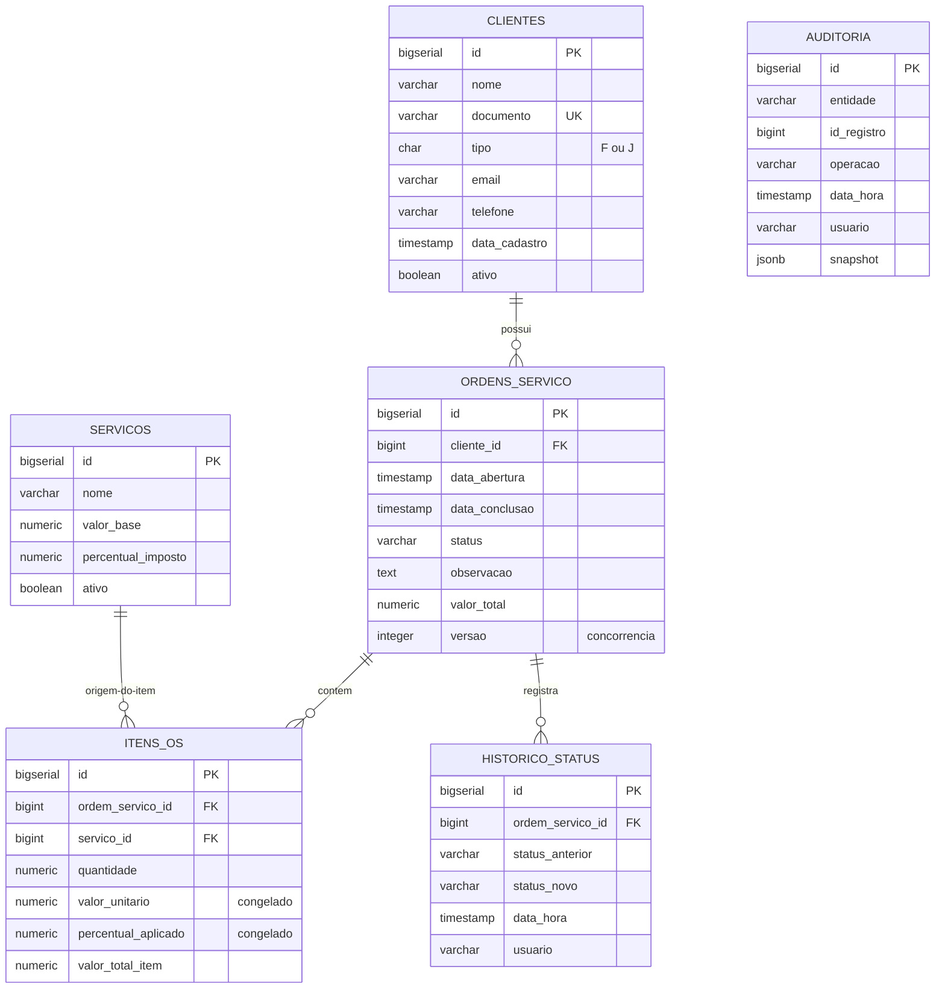

# Sistema de Gestão de Ordens de Serviço

> Teste prático para vaga de Desenvolvedor C# Pleno
> Stack: WinForms · .NET Framework 4.6.2 · PostgreSQL · Npgsql · ReportViewer

---

## Sumário

- [Visão geral](#visão-geral)
- [Stack utilizada](#stack-utilizada)
- [Arquitetura](#arquitetura)
- [Modelo de dados](#modelo-de-dados)
- [Decisões técnicas](#decisões-técnicas)
- [Estratégia de concorrência](#estratégia-de-concorrência)
- [Estratégia de auditoria](#estratégia-de-auditoria)
- [Como rodar](#como-rodar)
- [Estrutura de pastas](#estrutura-de-pastas)
- [Limitações conhecidas](#limitações-conhecidas)

---

## Visão geral

> _A preencher: descrição em 2-3 parágrafos do que o sistema faz, qual problema resolve e quais são as funcionalidades principais._

---

## Stack utilizada

| Componente | Versão | Motivo da escolha |
|---|---|---|
| .NET Framework | 4.6.2 | _A preencher_ |
| Visual Studio | 2026 | _A preencher_ |
| PostgreSQL | 14+ | _A preencher_ |
| Npgsql | 4.0.x | Compatível com .NET Framework 4.6.2 |
| Newtonsoft.Json | 12.x | Serialização do snapshot de auditoria |
| ReportViewer | 12.0.0 | Geração de relatórios RDLC |
| log4net | 2.0.x | _A preencher_ |

---

## Arquitetura

> _A preencher: explicação da arquitetura em camadas adotada, com diagrama em texto/ASCII das dependências._

### Camadas

- **OrdemServico.Entities** — POCOs sem dependências externas
- **OrdemServico.Infra** — Conexão com banco, logger, contexto de sessão
- **OrdemServico.Repositories** — Acesso a dados via Npgsql (sem regra de negócio)
- **OrdemServico.Services** — Regras de negócio e controle transacional
- **OrdemServico.Reports** — Arquivos `.rdlc` e DataSets tipados
- **OrdemServico.UI** — Camada de apresentação WinForms

### Regra de dependência

```
UI → Services → Repositories → Entities + Infra
```

Repositories não conhecem Services. Entities não dependem de nada. Essa é a regra que mantém o domínio isolado e testável.

---

## Modelo de dados



> A tabela `AUDITORIA` é polimórfica: liga-se a qualquer entidade via `entidade` + `id_registro`, sem FK física. Trade-off consciente entre genericidade (uma tabela audita tudo) e integridade referencial estrita.

---

## Decisões técnicas

> _A preencher conforme o desenvolvimento avança. Exemplos de tópicos a documentar:_
>
> - Por que Npgsql 4.x e não a versão mais recente
> - Por que valor unitário e percentual são copiados no item
> - Por que `jsonb` em vez de `text` para o snapshot de auditoria
> - Por que log4net e não Serilog
> - Por que paginação manual e não cursores

---

## Estratégia de concorrência

> _A preencher após implementar. Estrutura sugerida:_
>
> 1. Mecanismo escolhido (versão otimista via coluna `versao`)
> 2. Como funciona em pseudocódigo
> 3. O que acontece quando dois usuários alteram a mesma OS
> 4. Como o erro é apresentado ao usuário final

---

## Estratégia de auditoria

> _A preencher. Tópicos:_
>
> 1. Quais operações geram auditoria
> 2. Como o snapshot é gerado (Newtonsoft.Json)
> 3. Como o usuário é capturado (`SessionContext`)
> 4. Por que auditoria foi feita na aplicação e não 100% em trigger

---

## Como rodar

### Pré-requisitos

- Visual Studio 2026 (ou 2022 com workload "Desenvolvimento desktop com .NET")
- .NET Framework 4.6.2 Developer Pack
- PostgreSQL 14 ou superior
- Microsoft Report Viewer Runtime (instalado junto com o NuGet `Microsoft.ReportViewer.WinForms`)

### Setup do banco

```bash
# 1. Criar o banco no PostgreSQL
psql -U postgres -c "CREATE DATABASE ordem_servico;"

# 2. Rodar o script de criação
psql -U postgres -d ordem_servico -f database/01_schema.sql

# 3. (Opcional) Carregar dados de teste
psql -U postgres -d ordem_servico -f database/02_seeds.sql
```

### Configuração da string de conexão

Edite o arquivo `src/OrdemServico.UI/App.config` e ajuste a connection string para o seu ambiente:

```xml
<connectionStrings>
  <add name="PostgreSql"
       connectionString="Host=localhost;Port=5432;Database=ordem_servico;Username=postgres;Password=SUA_SENHA"
       providerName="Npgsql" />
</connectionStrings>
```

### Build e execução

1. Abra `src/OrdemServico.sln` no Visual Studio
2. Restaure os pacotes NuGet (botão direito na solução → "Restaurar pacotes NuGet")
3. Defina `OrdemServico.UI` como projeto de inicialização
4. Pressione `F5`

---

## Estrutura de pastas

```
ordem-servico-csharp/
├── docs/                     # Documentação extra
├── database/                 # Scripts SQL
│   ├── 01_schema.sql         # Criação de tabelas e constraints
│   └── 02_seeds.sql          # Dados de exemplo
└── src/                      # Código-fonte
    ├── OrdemServico.sln
    ├── OrdemServico.Entities/
    ├── OrdemServico.Infra/
    ├── OrdemServico.Repositories/
    ├── OrdemServico.Services/
    ├── OrdemServico.Reports/
    └── OrdemServico.UI/
```

---

## Limitações conhecidas

> _A preencher conforme aparecerem. Ser honesto aqui demonstra maturidade._
>
> Exemplos do que costumam aparecer:
>
> - Sistema de login é mock (sem autenticação real, apenas captura nome do usuário para auditoria)
> - Não há cobertura de testes automatizados (priorizado tempo nas demais fases)
> - Validação de e-mail é apenas formato, sem confirmação
